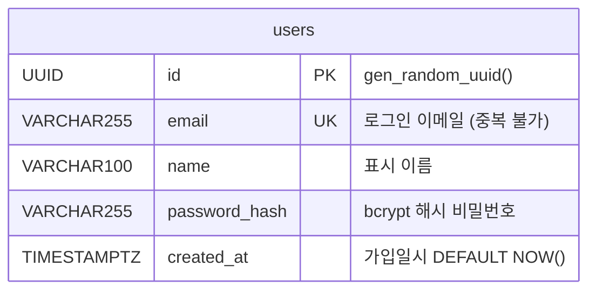
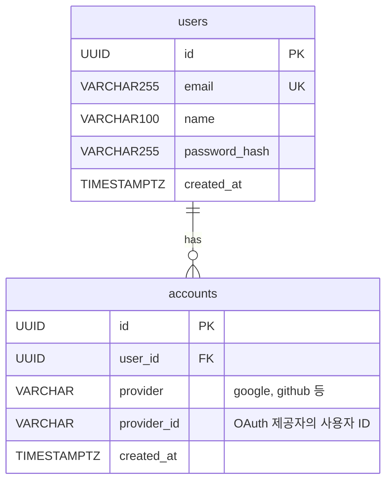

# ERD

## users 테이블

> `password_hash` 컬럼은 step-04에서 `password`(평문)로 시작해,
> step-07에서 `ALTER TABLE`로 이름을 변경합니다.

---

## 향후 확장 — OAuth 추가 시

Google·GitHub 로그인을 추가하면 `accounts` 테이블이 연결됩니다.

`||--o{` : 1명의 users는 여러 accounts를 가질 수 있다 (1:N 관계)
