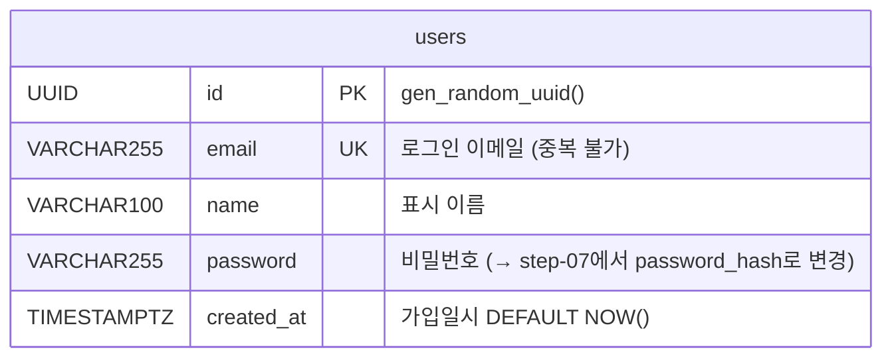
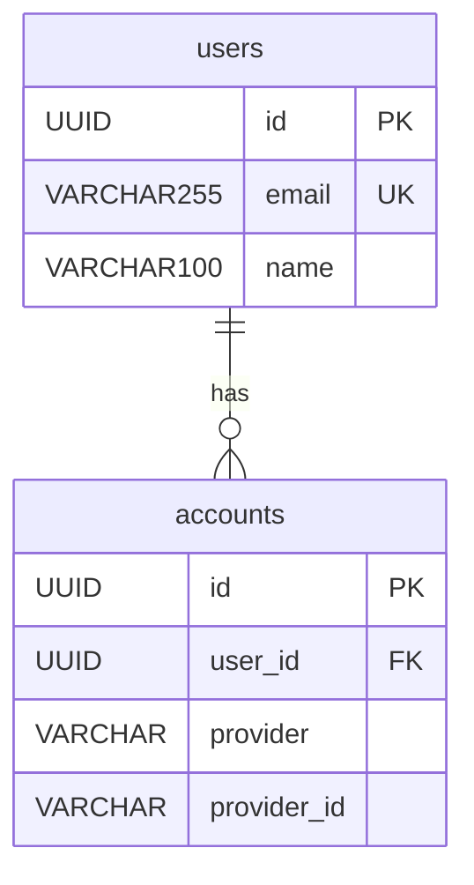

## Step 05 — Mermaid로 ERD 다시 그리기 `(15분)`

### 이 단계에서 하는 것

ERD Cloud에서 그린 테이블 구조를 Mermaid 문법으로 다시 작성합니다.
코드처럼 텍스트로 ERD를 표현하는 방법을 배웁니다.

---

### 1. Mermaid란

**Mermaid** 는 텍스트로 다이어그램을 그리는 도구입니다.

ERD Cloud는 GUI(마우스로 클릭)로 그립니다.
Mermaid는 **코드(텍스트)** 로 그립니다.

```
graph TD
    A --> B
```

위 텍스트 한 줄이 다이어그램이 됩니다.

**Mermaid를 쓰는 이유**:

| 항목 | ERD Cloud | Mermaid |
|------|-----------|---------|
| 작성 방법 | 마우스 클릭 | 텍스트 코드 |
| 버전 관리 | 불가 | Git으로 관리 가능 |
| GitHub/GitLab | 이미지 첨부 필요 | MD 파일에서 자동 렌더링 |
| 수정 방법 | GUI 열어야 함 | 텍스트 편집으로 즉시 수정 |

GitHub에서 `.md` 파일에 Mermaid 코드블록을 쓰면 **자동으로 다이어그램으로 렌더링**됩니다.
별도 이미지 파일이 필요 없습니다.

---

### 2. Mermaid ERD 기본 문법

````markdown
```mermaid
erDiagram
    테이블명 {
        타입 컬럼명 제약조건 "설명"
    }
```
````

제약조건 키워드:

| 키워드 | 의미 |
|--------|------|
| `PK` | Primary Key |
| `UK` | Unique Key |
| `FK` | Foreign Key |
| `NOT NULL` | 필수 입력 |

---

### 3. users 테이블 ERD 작성

`docs/db-integration/` 폴더에 `erd.md` 파일을 새로 만들고 아래 내용을 작성합니다:

````markdown
# ERD

## users 테이블


````

---

### 4. VS Code에서 미리보기

VS Code에서 Mermaid 다이어그램을 미리 보려면 확장을 설치합니다.

**설치**: VS Code 확장(Extension) 탭 → `Markdown Preview Mermaid Support` 검색 → Install

설치 후:

1. `erd.md` 파일 열기
2. 우상단 **미리보기** 아이콘 클릭 (또는 `Ctrl+Shift+V`)
3. Mermaid 다이어그램이 렌더링됩니다.

---

### 5. GitHub에서 자동 렌더링

`.md` 파일을 GitHub에 push하면 Mermaid 블록이 자동으로 다이어그램으로 표시됩니다.

이미지 파일 없이 텍스트만으로 문서에 다이어그램을 포함할 수 있고,
코드처럼 diff(변경 비교)가 가능합니다.

---

### 6. 향후 확장 예시

나중에 OAuth(구글 로그인 등)를 추가하면 `accounts` 테이블이 생깁니다.
Mermaid로 두 테이블의 관계를 표현하면:

````markdown

````

`||--o{` 기호가 "1명의 users는 여러 accounts를 가질 수 있다"는 관계를 나타냅니다.

---

### 이 단계에서 한 것

| 항목 | 완료 |
|------|------|
| Mermaid ERD 문법 이해 | ✓ |
| `docs/db-integration/erd.md` 작성 | ✓ |
| VS Code 미리보기 확인 | ✓ |
